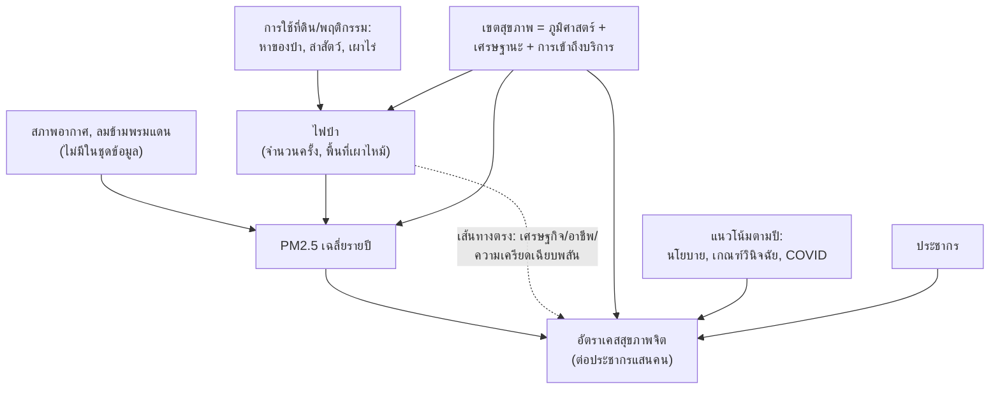

# เรื่องเล่าจากข้อมูล: ไฟป่า → PM2.5 → สุขภาพจิต (ประเทศไทย 2015–2023)

คำนวณจาก `data/processed/clean_province_year.csv` (77 จังหวัด × ปี 2015–2023 = 693 แถว, เชื่อมด้วยคีย์ `province_en` + `year`) และ `clean_wildfire_causes_long.csv`. สคริปต์คำนวณอยู่ใน scratchpad ของ session นี้ ไม่ได้เก็บไว้ในโปรเจกต์ — ตัวเลขทั้งหมดด้านล่างคือผลจริงจากข้อมูลที่มีอยู่ในโปรเจกต์

## 1. ห่วงโซ่ความสัมพันธ์ที่ตั้งสมมติฐานไว้ (Causal DAG)

จุดสำคัญ: **HealthRegion** และ **YearTrend** เป็นตัวแปรกวน (confounder) ที่ชี้เข้าทั้งฝั่งไฟป่า/PM2.5 และฝั่งสุขภาพจิตพร้อมกัน — ถ้าไม่คุมสองตัวนี้ ความสัมพันธ์ดิบ (raw correlation) จะประเมินค่าคลาดเคลื่อนได้ทั้งสูงเกินและกลับทิศ

## 2. สิ่งที่คำนวณได้จริง

### 2.1 ไฟป่า → PM2.5 (แข็งแรงและเชื่อถือได้ที่สุดในทั้งชุด)

| ระดับ | ความสัมพันธ์ |
| --- | --- |
| จังหวัด-ปี (n=455) | Pearson r = 0.24, **Spearman ρ = 0.62** (p<0.0001) |
| % พื้นที่เผาไหม้ vs PM2.5 (n=325) | Spearman ρ = 0.67 (p<0.0001) |
| ระดับประเทศต่อปี (n=7) | **r = 0.93 (p=0.003)** |

ไฟป่ากับ PM2.5 สัมพันธ์กันแบบไม่เชิงเส้น (Spearman แรงกว่า Pearson มาก) — ปีที่ไฟป่ารุนแรงคือปีที่ PM2.5 เฉลี่ยทั้งประเทศสูงตามชัดเจน นี่คือความสัมพันธ์เดียวในชุดข้อมูลที่หนักแน่นพอจะเรียกว่า "แทบไม่ต้องสงสัย"

### 2.2 ไฟป่า/PM2.5 → สุขภาพจิต แบบดิบ (raw correlation, ไม่คุมตัวแปรกวน)

| คู่ตัวแปร | Pearson r | p-value |
| --- | --- | --- |
| พื้นที่ไฟป่า vs อัตราซึมเศร้า | 0.29 | <0.0001 |
| พื้นที่ไฟป่า vs อัตราฆ่าตัวตาย | 0.12 | 0.004 |
| PM2.5 vs อัตราซึมเศร้า | 0.10 | 0.023 |
| PM2.5 vs อัตราวิตกกังวล | **-0.11** | 0.010 |
| PM2.5 vs อัตราจิตเภท | **-0.11** | 0.015 |

ดูเหมือนมีสัญญาณ แต่ทิศทางไม่สอดคล้องกัน (บางตัวเป็นลบ) และขนาดผลเล็กมาก (r ~0.1) — นี่คือจุดที่ต้องระวัง "ตัวแปรกวน" ก่อนสรุปว่าไฟป่าทำให้สุขภาพจิตแย่ลง

### 2.3 เมื่อคุมตัวแปรกวน (จังหวัด + ปี แบบ fixed effects) — สัญญาณส่วนใหญ่หายไปหรือกลับทิศ

รันการถดถอย `mental_health_rate ~ log(wildfire_area+1) + pm25_avg + จังหวัด(FE) + ปี(FE)` เพื่อดูว่าเมื่อเทียบ "จังหวัดเดียวกัน ปีเดียวกัน" (ตัดผลของภูมิศาสตร์และแนวโน้มเวลาออก) ไฟป่า/PM2.5 ยังอธิบายสุขภาพจิตได้ไหม:

| ตัวแปรตาม (n=448) | log(พื้นที่ไฟป่า) | PM2.5 |
| --- | --- | --- |
| อัตราซึมเศร้า | coef=-1.19, p=0.72 (ไม่มีนัยสำคัญ) | coef=**-7.92, p=0.004** (นัยสำคัญ แต่ทิศ**ลบ**) |
| อัตราวิตกกังวล | coef=-8.13, p=0.034 (นัยสำคัญ ทิศลบ) | coef=-4.78, p=0.13 |
| อัตราฆ่าตัวตาย | coef=0.14, p=0.61 | coef=**0.70, p=0.003** (นัยสำคัญ ทิศบวก) |
| อัตราเคสสุขภาพจิตรวม | coef=-7.36, p=0.75 | coef=-33.3, p=0.08 |

**สรุปตรงนี้คือประเด็นหลักของเรื่องเล่า**: ความสัมพันธ์ดิบที่ดูเหมือนมี (ข้อ 2.2) ส่วนใหญ่อธิบายได้ด้วย "จังหวัดไหนก็ตามที่มีไฟป่า/PM2.5 สูงเป็นทุนเดิม" ไม่ใช่ปีที่ไฟป่ารุนแรงขึ้นแล้วสุขภาพจิตแย่ลงตาม — เมื่อคุมจังหวัดกับปีแล้ว ไฟป่าแทบไม่เหลือผล และ PM2.5 ให้ผลลัพธ์ไม่สอดคล้องกัน (ลบกับซึมเศร้า, บวกกับฆ่าตัวตาย) ซึ่งบ่งชี้ว่า**ข้อมูลชุดนี้ยังไม่พอจะสรุปว่าไฟป่า/PM2.5 เป็นสาเหตุของปัญหาสุขภาพจิต** ต้องตีความเป็น "มีความเชื่อมโยงเชิงพื้นที่ที่ยังอธิบายไม่ได้ทั้งหมด" มากกว่า

### 2.4 Lag-1 ปี (PM2.5 ปีนี้ vs สุขภาพจิตปีถัดไป จังหวัดเดียวกัน)

ผลใกล้เคียงศูนย์เกือบทุกตัว (r อยู่ระหว่าง -0.12 ถึง 0.22) ไม่มีรูปแบบชัดเจนว่าการสัมผัส PM2.5 ปีก่อนหน้าทำนายสุขภาพจิตปีถัดมาได้ดีกว่าปีเดียวกัน

### 2.5 สาเหตุไฟป่า — ข้อเท็จจริงที่ขัดกับภาพจำทั่วไป

| สาเหตุ | พื้นที่เผาไหม้สะสม (ล้านไร่, ตามหน่วยดิบในไฟล์) |
| --- | --- |
| **หาของป่า** | 850.2 |
| ไม่ทราบสาเหตุ | 363.4 |
| ล่าสัตว์ | 157.5 |
| อื่น ๆ | 86.3 |
| **เผาไร่ (slash-and-burn)** | 57.1 |

"เผาไร่" ที่มักถูกกล่าวโทษเป็นอันดับ 1 ในสื่อ จริง ๆ แล้วอยู่อันดับ 5 ในข้อมูลนี้ — "หาของป่า" เป็นสาเหตุหลักแบบทิ้งห่างมาก นี่คือ headline ที่ story-worthy สำหรับหน้าแรกของ dashboard

### 2.6 ทำไมเขตสุขภาพถึงเป็นตัวแปรกวนตัวใหญ่

| เขตสุขภาพ | พื้นที่ไฟป่าเฉลี่ย (ไร่) | PM2.5 เฉลี่ย | อัตราซึมเศร้าเฉลี่ย |
| --- | --- | --- | --- |
| 1 (เหนือบน) | 6,960 | 37.3 | 725 |
| 2 (เหนือล่าง) | 2,891 | 35.5 | 528 |
| 12 (ใต้) | 143 | 26.1 | 422 |
| 13 (กทม.) | n/a | 32.5 | 163 |

เขต 1 มีทั้งไฟป่าสูงสุด PM2.5 สูงสุด และอัตราซึมเศร้าสูงสุด พร้อมกัน — เป็นตัวอย่างชัดของ "confounding by geography" ที่ทำให้ raw correlation ในข้อ 2.2 ดูแรงกว่าความจริง ส่วนกทม. (เขต 13) มีอัตราซึมเศร้ารายงานต่ำที่สุดทั้งที่ประชากรเมืองมักมีความชุกโรคจิตเวชไม่ต่ำ — น่าจะสะท้อนความแตกต่างของ "การวินิจฉัย/การเข้าถึงบริการ" มากกว่าความชุกจริง ซึ่งเป็นข้อจำกัดสำคัญของข้อมูลเคสสุขภาพจิตแบบนี้

## 3. ข้อจำกัดที่ต้องระบุคู่กับทุกกราฟ

- **Ecological fallacy**: ข้อมูลระดับจังหวัด-ปี ไม่สามารถสรุปเป็นระดับบุคคลได้
- **PM2.5 รายปีหยาบเกินไป**: ค่าเฉลี่ยทั้งปีกลบพีคช่วงฤดูไฟป่า (ก.พ.-เม.ย.) ที่น่าจะเป็นตัวที่กระทบสุขภาพจิตจริง ๆ มากกว่า — ถ้ามีข้อมูลรายเดือนจะทดสอบ mediation ได้แม่นกว่านี้มาก
- **อัตราเคสสุขภาพจิต = ขึ้นกับการวินิจฉัย/การเข้าถึงบริการ** ไม่ใช่ความชุกที่แท้จริงล้วน ๆ (เห็นชัดจากกทม.)
- **n=7-9 ปี** ที่ระดับประเทศ ทำให้ผลระดับประเทศ (ตาราง 2.1 แถวสุดท้าย, และการไม่พบผลนัยสำคัญของ wildfire→mental health ระดับประเทศ) มีกำลังทางสถิติต่ำ ตีความอย่างระมัดระวัง
- **2020-2021 เป็น outlier**: นโยบาย COVID กระทบทั้งรูปแบบไฟป่า (ล็อกดาวน์) และการเข้าถึงบริการสุขภาพจิต พร้อมกัน อาจบิดเบือนแนวโน้มปี

## 4. ถ้าจะคำนวณต่อให้แน่นขึ้น

1. เปลี่ยน PM2.5 เป็นค่าเฉลี่ยเฉพาะฤดูไฟป่า (ก.พ.-เม.ย.) แทนค่าเฉลี่ยทั้งปี แล้วทดสอบ mediation (wildfire → seasonal PM2.5 → mental health) ด้วย Sobel test หรือ bootstrap
2. เพิ่มตัวแปรควบคุมเศรษฐกิจ-สังคม (รายได้เฉลี่ย, สัดส่วนเกษตรกรรม, จำนวนบุคลากรสุขภาพจิตต่อประชากร) เพื่อแยก "confounding by region" ออกจากผลจริง
3. ใช้ event-study / difference-in-differences รอบปีที่ไฟป่ารุนแรงผิดปกติ (2019-2020, 2023) เทียบจังหวัดที่โดนหนักกับจังหวัดที่โดนเบา
4. ถ้ามีข้อมูลระดับอำเภอหรือรายเดือน จะเพิ่มกำลังทางสถิติและลด ecological fallacy ได้มาก

---
*หมายเหตุ: ตัวเลขทั้งหมดคำนวณจาก `data/processed/clean_province_year.csv` และ `clean_wildfire_causes_long.csv` ในโปรเจกต์นี้ ด้วย pandas/scipy/statsmodels — ไม่ใช่ข้อมูลสมมติ*
